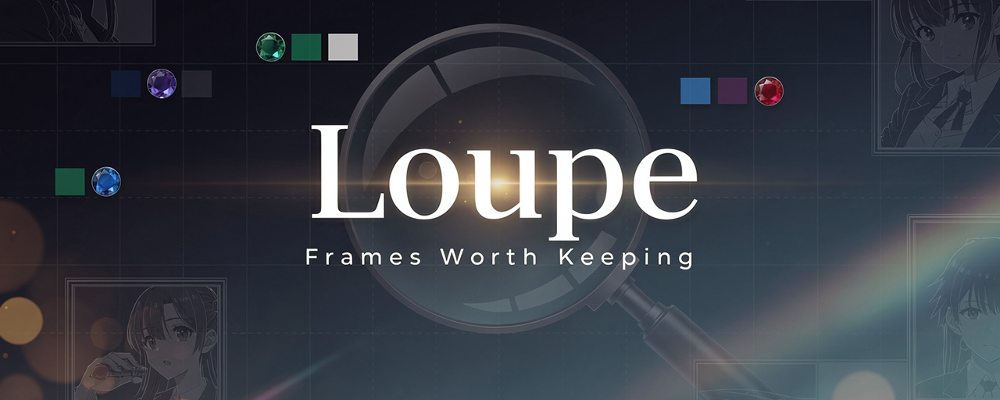
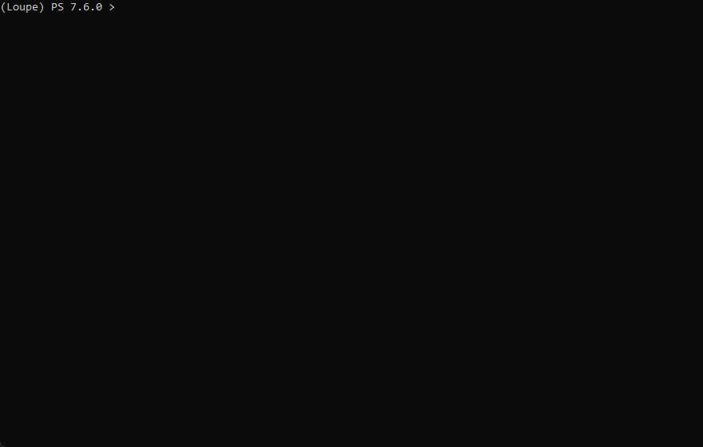
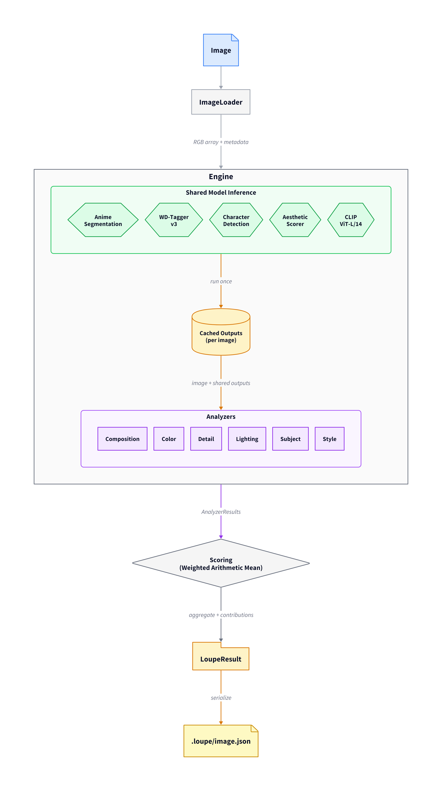

<!-- markdownlint-disable MD041 -->



[](LICENSE) [](https://www.python.org/) [](https://pytorch.org/) [](https://docs.astral.sh/ruff/) [](https://microsoft.github.io/pyright/) [](https://docs.astral.sh/uv/)

Aesthetic analysis for anime screenshots. Loupe scores frames across six independent dimensions -- composition, color, detail, lighting, subject, and style -- producing structured data that lets you sort hundreds of screenshots and review them top-down instead of eyeballing every frame.

The human remains the curator. Loupe surfaces the multi-dimensional profile of each image so you can make faster, more informed keep/discard decisions.

## Quick Example

```bash
loupe analyze screenshot.png
```

```text
screenshot.png

 Dimension     Score  Tags
 color         0.701  harmonic_L, cool_palette, diverse_palette
 composition   0.620  centered, balanced, symmetric, diagonal_composition, open_composition
 detail        0.708  high_detail, rich_background, detailed_character, sharp_rendering,
                      complex_shading, fine_line_work
 lighting      0.722  dramatic_lighting, high_contrast, soft_shadows, atmospheric,
                      balanced_exposure, directional_light
 subject       0.781  closeup, strong_separation, shallow_dof, complete_subject
 style         0.529  naturalistic_anime

 Aggregate: 0.690  (balanced)
```



Results are written as JSON sidecar files alongside the images:

```text
screenshots/
├── image.png
└── .loupe/
    └── image.png.json
```

Each sidecar contains the full analysis -- per-dimension scores, tags with confidence values, sub-property breakdowns, and aggregate scoring metadata:

```json
{
  "image_path": "screenshot.png",
  "image_metadata": { "width": 1920, "height": 1080, "format": "png" },
  "analyzer_results": [
    {
      "analyzer": "composition",
      "score": 0.723,
      "tags": [
        { "name": "rule_of_thirds", "confidence": 0.81, "category": "composition" },
        { "name": "balanced", "confidence": 0.74, "category": "composition" }
      ],
      "metadata": { "sub_scores": { "rule_of_thirds": 0.81, "visual_balance": 0.74, "..." : "..." } }
    }
  ],
  "aggregate_score": 0.649,
  "scoring": {
    "method": "weighted_mean",
    "weights": { "composition": 0.182, "color": 0.182, "..." : "..." },
    "contributions": { "composition": 0.131, "color": 0.124, "..." : "..." },
    "reliable": true
  },
  "schema_version": "1.0"
}
```

Delete `.loupe/` to cleanly remove all Loupe artifacts. Image contents are never modified (`--rename` prefixes filenames only).

## Installation

Requires Python 3.13+ and a CUDA-capable GPU (recommended).

```bash
git clone https://github.com/aporonaut/Loupe.git && cd Loupe
uv sync

# Download models (~2 GB, one-time)
uv run loupe setup
```

Loupe uses PyTorch with CUDA 12.8. The `uv sync` command handles PyTorch index routing automatically via `pyproject.toml`.

<details>
<summary>cuDNN note (Windows)</summary>

ONNX Runtime needs cuDNN 9.x for GPU acceleration. Loupe automatically finds the cuDNN bundled with PyTorch -- no separate install needed. If you see CUDA fallback warnings, your PyTorch installation may be missing CUDA support.

</details>

## Usage

| Command | Purpose |
| --- | --- |
| `loupe analyze <path>` | Score images across six aesthetic dimensions |
| `loupe rank <path>` | List images sorted by aggregate score |
| `loupe report <path>` | Batch summary statistics and correlations |
| `loupe clean <path>` | Strip Loupe prefixes and remove `.loupe/` data |
| `loupe tags` | List all tags Loupe can produce |
| `loupe setup` | Download required models (~2 GB, one-time) |

### Common workflows

```bash
# Analyze a directory, then rank the results
loupe analyze screenshots/ && loupe rank screenshots/

# Re-rank with a composition-focused preset (no re-analysis needed)
loupe rank screenshots/ --preset composition

# Prefix filenames with Loupe scores for easy sorting in a file browser
loupe rank screenshots/ --rename

# Use rank-based prefix instead (L001-, L002-, ...)
loupe rank screenshots/ --rename --rename-style rank

# After review: strip prefixes and remove analysis data
loupe clean screenshots/

# Re-analyze everything, ignoring existing sidecars
loupe analyze screenshots/ --force

# Show all tags per dimension (not just top 3)
loupe analyze screenshot.png --verbose
```


## Architecture



## How Scoring Works

Each analyzer produces an independent 0.0--1.0 score. The aggregate score is a Weighted Arithmetic Mean of these per-dimension scores -- dimensions with higher weights contribute more to the final number. See [Scoring Reference](docs/scoring.md) for the full formula, JSON output fields, and custom weight configuration.

### Presets

Presets control the relative weight of each dimension:

| Preset | Composition | Color | Detail | Lighting | Subject | Style |
| --- | --- | --- | --- | --- | --- | --- |
| `balanced` | 1.0 | 1.0 | 1.0 | 1.0 | 1.0 | 0.5 |
| `composition` | 3.0 | 1.0 | 1.0 | 1.0 | 1.0 | 0.5 |
| `visual` | 1.0 | 2.0 | 2.0 | 1.0 | 1.0 | 0.5 |

Style is weighted at 0.5 by default because the aesthetic scorer provides limited discriminative signal for intra-anime quality comparison.

## Analyzers

Each analyzer measures one aesthetic dimension, producing a score and contextual tags. See [Analyzer Reference](docs/analyzers.md) for full methodology, all tags, and scoring interpretation.

### Composition

Evaluates spatial arrangement using classical computer vision (OpenCV + NumPy). Measures rule of thirds placement, visual balance, symmetry, leading lines, diagonal structure, negative space, depth layering, and framing. No model dependencies.

High scores indicate strong compositional structure with clear subject placement and visual flow. Low scores suggest cluttered or center-heavy framing.

Example tags: `rule_of_thirds`, `balanced`, `diagonal_composition`, `open_composition`

### Color

Analyzes palette design via Matsuda harmony scoring across 8 template types, palette extraction using K-means in OkLab color space, colorfulness, saturation balance, color contrast, temperature consistency, and diversity. Fully classical.

High scores indicate harmonious, intentional palettes. Low scores suggest muddy or clashing color usage.

Example tags: `harmonic_V`, `warm_palette`, `vivid`, `diverse_palette`

### Detail

Measures visual complexity through edge density, spatial frequency, texture richness (GLCM), shading granularity, line work quality, and rendering clarity. Analysis is region-separated (character vs background) using the shared segmentation model, with configurable region weights (default 60% background, 40% character).

High scores indicate rich textures, fine line work, and sophisticated shading. Low scores indicate flat or simple rendering.

Example tags: `high_detail`, `rich_background`, `sharp_rendering`, `complex_shading`

### Lighting

Evaluates illumination design through contrast ratio, light directionality, rim/edge lighting, shadow quality, atmospheric bloom effects, and tonal balance. Classical CV on the V (value) channel, supplemented with WD-Tagger predictions for lighting-specific labels.

High scores indicate dramatic, intentional illumination design. Low scores suggest flat or uncontrolled lighting.

Example tags: `dramatic_lighting`, `rim_lit`, `atmospheric`, `directional_light`

### Subject

Assesses focal emphasis via saliency concentration, figure-ground separation (OkLab color difference), depth-of-field detection, negative space utilization, subject completeness, and subject scale. Requires the shared segmentation and detection models to identify subjects. Scores floor at 0.1 for environment shots (no character detected).

High scores indicate strong focal emphasis with clear figure-ground separation. Low scores suggest unclear subject or landscape composition.

Example tags: `medium_shot`, `strong_separation`, `shallow_dof`, `complete_subject`

### Style

Measures artistic identity through aesthetic quality (deepghs anime aesthetic scorer, ONNX) and experimental layer consistency (classical CV). Categorical tags from WD-Tagger (art style) and CLIP ViT-L/14 (zero-shot style classification) do not affect the score. This is the least mature analyzer -- style scores have very low variance (~0.02 std).

Example tags: `aesthetic_great`, `digital_modern_anime`, `cel_shading`, `consistent_rendering`

## Configuration

Loupe uses layered TOML configuration:

1. **Defaults**: `config/default.toml`
2. **User config**: `~/.config/loupe/config.toml` (or `--config` flag)
3. **CLI overrides**: `--preset`, `--force`, etc.

### Per-analyzer configuration

Each analyzer can be enabled/disabled and configured independently:

```toml
[analyzers.color]
enabled = true
confidence_threshold = 0.25

[analyzers.color.params]
n_clusters = 6  # K-means palette clusters

[analyzers.detail.params]
bg_weight = 0.6    # Background region weight
char_weight = 0.4  # Character region weight
```

## Models

All models are downloaded once via `loupe setup` and cached locally. Analysis runs fully offline after setup.

| Model | Purpose | Used by |
| --- | --- | --- |
| [anime-segmentation](https://github.com/SkyTNT/anime-segmentation) (ONNX) | Character mask | Detail, Lighting, Subject, Style |
| [WD-Tagger v3](https://huggingface.co/SmilingWolf/wd-swinv2-tagger-v3) (SwinV2) | Tag prediction | Style, Lighting |
| [deepghs detection](https://huggingface.co/deepghs) (ONNX) | Face/head/person boxes | Subject |
| [deepghs aesthetic](https://huggingface.co/deepghs/anime_aesthetic) (ONNX) | Aesthetic quality | Style |
| [CLIP ViT-L/14](https://github.com/mlfoundations/open_clip) (OpenAI) | Style embeddings | Style |

Total VRAM usage: ~5.1 GB (fits RTX 3070 8 GB comfortably).

## Performance

On an RTX 3070 with CUDA, typical throughput is ~1.4 seconds per image (~170 images in 4 minutes). The time splits roughly:

- Model inference (7 passes): ~60% of per-image time
- Classical CV (color K-means, composition, detail): ~40%
- Scoring/I/O: negligible

## Known Limitations

- **Style dimension has low variance** (std ~0.02 across diverse images) -- the aesthetic scorer provides limited discriminative power for intra-anime comparison. Style is downweighted to 0.5 in the default preset.
- **Subject floors at 0.1 for environment shots** -- when the segmentation model finds no character, subject scores 0.1 with `environment_focus`. This is by design but penalizes intentional environment/object-focused compositions.
- **Segmentation fails on non-standard art styles** -- painterly, watercolor, or heavily stylized frames may not have characters detected even when figures are visible.
- **Scores are not comparable across art styles** -- a Kyoto Animation frame and a Madhouse frame have fundamentally different visual profiles. Rankings are most meaningful within a single title or similar style.
- **Loupe measures visual properties, not narrative significance** -- a dramatically important scene with poor composition will score low. The human review pass accounts for this.

## Development

```bash
# Install dev dependencies
uv sync --extra dev

# Format
ruff format .

# Lint
ruff check .

# Type check
uv run pyright src/

# Run tests
uv run pytest

# Run all verification steps
just verify

# Run benchmarks
uv run pytest tests/test_benchmarks.py --benchmark-only
```

## License

Licensed under the [Apache License 2.0](LICENSE).

---

<div align="center">
  
</div>
